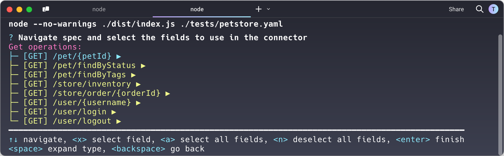

# OAS to Apollo Connector generator

## Introduction

This project is a simple tool to generate an [Apollo Connector](https://www.apollographql.com/graphos/apollo-connectors) 
from an OpenAPI Specification (OAS) file. The input specification can be 3.x+ and either `YAML` or `JSON`. 

Note: this project is experimental and not all OAS specification options are covered. This means you are likely to 
find bugs, things that are not yet implemented, etc. Whilst we have done our best to test this tool, there's no
guarantee that it will work for all OAS files. That said, we welcome any feedback, bug reports, and contributions - and
specially any OAS specifications you would like to add to the test suite.

## Running the tool:

1. clone the repository, and run `npm run build` (or use `ts-node` if that is your preference)

```shell
node --version
v22.12.0
```

```shell
node ./dist/index.js -h
Usage: index [options] <source>

Arguments:
  source                source spec (yaml or json)

Options:
  -V, --version         output the version number
  -i --skip-validation  Skip validation step (default: false)
  -n --skip-selection   Generate all [filtered] paths without prompting for a selection (default: false)
  -l --list-paths       Only list the paths that can be generated (default: false)
  -g --grep <regex>     Filter the list of paths with the passed expression (default: "*")
  -p --page-size <num>  Number of rows to display in selection mode (default: "10")
  -h, --help            display help for command
```

2. Run the tool with the path to the OAS file as the first argument. 

```shell
node --no-warnings ./dist/index.js ./tests/petstore.yaml
```

This will display an ouptut similar to the following:


3. Navigate using the arrow keys and select the paths you want to generate using the `x` key. You can also use the `a`
key to select all paths, or the `n` key to deselect all paths.

Once you've selected the paths you want to generate, press the `Enter` key to generate the Apollo Connector. Here's
an example of the output when selecting all the fields from `[GET] /pet/{petId`:

```graphql
extend schema
  @link(url: "https://specs.apollo.dev/federation/v2.10", import: ["@key"])
  @link(
    url: "https://specs.apollo.dev/connect/v0.1"
    import: ["@connect", "@source"]
  )
  @source(name: "api", http: { baseURL: "https://petstore3.swagger.io/v3" })

scalar JSON

type Pet {
  category: Category
  id: Int
  name: String
  photoUrls: [String]
  "pet status in the store"
  status: String
  tags: [Tag]
}

type Category {
  id: Int
  name: String
}

type Tag {
  id: Int
  name: String
}

type Query {
  """
  Find pet by ID (/pet/{petId})
  """
  petByPetId(petId: Int!): Pet
    @connect(
      source: "api"
      http: { GET: "/pet/{$args.petId}" }
      selection: """
      category {
       id
       name
      }
      id
      name
      photoUrls
      status
      tags {
       id
       name
      }
      """
    )
}
```

## Options

The tool allows listing paths and filtering them using a regular expression. This is useful when you have large specs
and only want to generate a subset of the paths. First, you can list all the paths using the `-l` flag:

```shell
node --no-warnings ./dist/index.js ./tests/petstore.yaml --list-paths

get:/pet/{petId}
get:/pet/findByStatus
get:/pet/findByTags
get:/store/inventory
get:/store/order/{orderId}
get:/user/{username}
get:/user/login
get:/user/logout
```

### Filtering paths
If you'd like to filter the paths using a regular expression, you can use the `-g` flag. For example, to only list the
operations ending with an argument, you can use the following command:

```shell
node --no-warnings ./dist/index.js ./tests/petstore.yaml  --list-paths  --grep "{\\w+}$"

get:/pet/{petId}
get:/store/order/{orderId}
```

or, for instance, filtering by a specific path:

```shell
node --no-warnings ./dist/index.js ./tests/petstore.yaml  --list-paths  --grep "/pet/"

get:/pet/{petId}
get:/pet/findByTags
```

## Skipping validation

By default, the tool will validate the OAS specification before generating the Apollo Connector. However, sometimes 
specifications are not fully compliant with the OAS standard, or you may want to skip this step for other reasons. To
do so, simply add the `-i` (or `--skip-validation`) flag to the command.

## Page size

When selecting paths, the tool will display a list of paths with a default page size of 10. You can change this value
using the `-p` (or `--page-size`) flag. For example, to display 40 rows per page, you can use the following command:

```shell
node --no-warnings ./dist/index.js ./tests/petstore.yaml  --page-size 40
```

## Generating all paths without selection

Whilst this option is not recommended for large specifications, you can generate all paths without prompting for a
specific selection. To do so, you can use the `-n` (or `--skip-selection`) flag. This may result in a very large
Apollo Connector schema, and might take a long time. Also, it kind of defeats the purpose of generating a connector based
on a specific set of paths and fields, so use with caution.